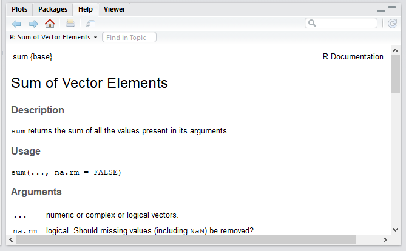

Learning a new software is like learning a new language, and some functions or commands will be like unknown words. An important function in R is help. For example, if we wanted to know how exactly to use the sum function, we could type `help(sum)`. You will see the results in the bottom-right panel.

```{r helpsum, message=FALSE, warning=FALSE, paged.print=FALSE}
help(sum)
```

or by using the question mark sign (?)


```{r helpsum2, message=FALSE, warning=FALSE, paged.print=FALSE}
?sum
```
 


# How to use the help page

All help pages, like the one shown above, follow the same structure. 


Name   | Value
-------|-------------------
**Description** | A brief description of the function
**Usage** | The complete syntax that includes all possible functions
**Arguments** | A brief explanation of all arguments
**Details**| Any relevant detail related to the function and its arguments
**Value** | The output values of the function
**Examples** | Examples of how to use the function

