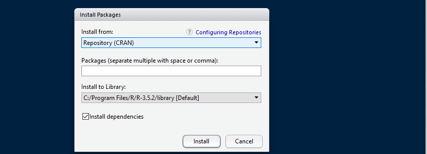

**What is a package in RStudio?**

Packages in RStudio are like apps we are using on our smartphones. For example, if you want to talk to your friends you will install WhatsApp or any other app you prefer. This is the case with R - some statistical actions require specific packages.

**How to install a package in R**

You may install a package by typing \`install.packages("name of the package")'. Below you may find an example on how to install one of the most important packages in R, tidyverse:

```{r, eval = FALSE, message=FALSE, warning=FALSE, paged.print=FALSE}
install.packages("tidyverse")
```

Alternatively, you may install any package you need by clicking on the Packages tab in the bottom right pane and then click install. A dialog box will appear. In the install Packages dialog write the name of the package you want to install and click install. This will install the package you are looking for.




**How to load a package**

Once your package is installed, you are ready to use it. The easiest way to do that is by typing `library(name of the package)'. For example lets load the tidyverse package:

```{r, eval = FALSE, message=FALSE, warning=FALSE, paged.print=FALSE}
library(tidyverse)
```
