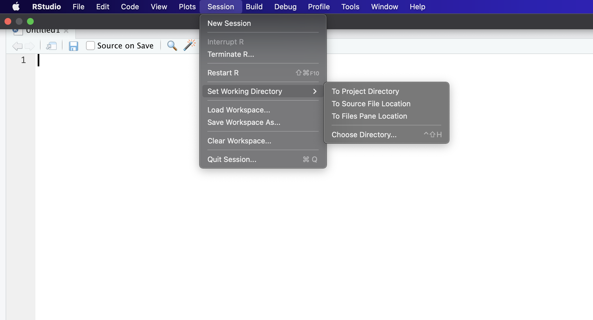
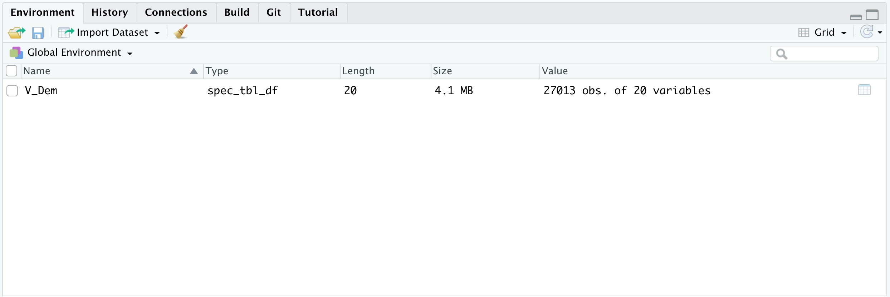
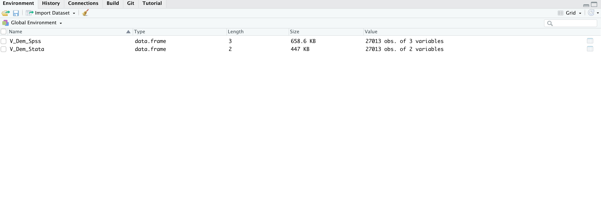

Now that we have seen some examples of how we can use the pre-installed datasets in R, we can look at some common ways of loading in our own data into the R environment for analysis. This will become more useful as your find and develop your own datasets for any future projects (after all, if you can't load your data correctly how can you analyse it?).

You will find all datasets that we will be using in the 'datasets' section of SurreyLearn.

#### Learning Objectives

By the end of this section you should be able to:

{}
* Set your working directory and get your working directory location.
* load R data and .csv files using the 'tidyverse' package.
* load STATA and SPSS data.
{}


##  Loading .csv data using 'tidyverse'

```{r, message=FALSE, warning=FALSE, paged.print=FALSE}
# To practice this method you will need to install the tidyverse package.

install.packages("tidyverse")

# Once you have installed tidyverse, use the below command to call it from your library. 

library("tidyverse")

# Note you will only need to install a package once, there is no need to use the install.packages on the same package after you have installed it once.
```
The tidyverse has a number of packages within it, including the `readr` package. We can use the `read_csv()` function in the `readr` package to load in a comma delimited file (.csv). It is very common that you will be able to access data in a csv format, if your data is in .xls or .xlsx format it is recommended that you 'export as' a .csv. This will make it much easier for you to load it into your enviroment with the `read_csv()` function.

From the data section of SurreyLearn please download the 'V_Dem.csv' file and save it in your working directory. If you are not sure about the location of your working directory use the `getwd()` function to locate our working directory.

```{r, message=FALSE, warning=FALSE, paged.print=FALSE}
getwd()

#In you console you should now see somthing like:

[1] "/Users/michealslade/Documents/GitHub/Quants_website_2021/Learn_update_2021"

```
*Note* if you do not get an output, this means you have not set your working directory yet. You can do this by selecting a folder from the session dropdown menu and selecting the 'Choose Directory...' option as illustrated below.




Once you have set your working directory and run `getwd` you will notice that the output in the console will be unique to each of you. This is because the file path shows you the location of working directory in your personal computer. Now that that we have the tidyverse package loaded as well as the location of our file path and data, we move on to practicing how to load in our csv with one simple line of code.


```{r, message=FALSE, warning=FALSE, paged.print=FALSE}

# We are going to use the flowing format to load in our data

read_csv("file path + name of file ")

# In this case the name of the is 'V_Dem.csv'. So your file path should look something like mine below.

V_Dem<- read_csv("/Users/michealslade/Documents/GitHub/Quants_website_2021/Learn_update_2021/content/Introduction/Loading_Data/V_Dem.csv")

```
You should now have the below dataset in your Global Environment.



## Loading STATA & SPSS using the 'sjlabelled'

When with with political data you will inevitably come across a variety data types that are generated from other statistical softwares such as STATA and SPSS. STATA saves data as a `.dta` file type while SPSS typically saves files as a `.sav` file type. Similar to the `.csv`, we will need to ustilise an r package to load this data into our R environment for analysis.

For this we will need to utlise the `sjlabelled` package.

```{r, message=FALSE, warning=FALSE, paged.print=FALSE}
# Again we will need to install the package.

install.packages("sjlabelled")

# Once you have installed sjlabelled, we again need to call it from our 'library'

library("sjlabelled")

```
Once you have completed calling these two functions you are ready to begin practicing loading STATA and SPSS data. For the next part of this exercise you will need to download the 'V_Dem.dta' and 'V_Dem.sav' data from the datasets section of the SurreyLearn module page.

One you have these two datasets downloaded move them to your working directory. Remember you can use the `getwd()` function if you are not sure where your working directory is. Now we will use the `read_spss` and `read_stata` functions in sjlabelled to load in these two datasets.

```{r,}

# get your working directory 
getwd()

# Once you have this add the name of we can load in the two V_Dem files as follows file as follows:

# For SPSS data 

V_Dem_Spss <- read_spss("/Users/michealslade/Documents/GitHub/Quants_website_2021/Learn_update_2021/content/Introduction/Loading_Data/V_Dem.sav")

# For STATA data 

V_Dem_Stata <- read_stata("/Users/michealslade/Documents/GitHub/Quants_website_2021/Learn_update_2021/content/Introduction/Loading_Data/V_Dem.dta")

#Viola!
```

You now should be able to see two datsets in your global environment as in the image below. If you are having issues dont forget to replace my file path above with yours and ensure that the file path is between the "" symbol.



# Recap

{}
* You can set your working directory and get your working directory using the `setwd()` and `getwd()` commands respectively.
* You should be able to load R data () and .csv (`read_csv`) files using the 'tidyverse' package.
* You should be able to load STATA (`read_stata`) and SPSS data (`read_spss`) using the 'sjlabelled' package.
{}


