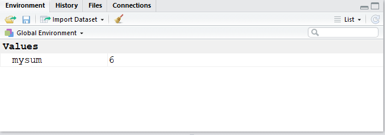

We now know how to use a function using the parenthesis sign `()`, but we are also interested in the output of a function.

In RStudio we use the assignment operator &leftarrow; for creating or updating existing objects. If we wanted to save the results of `sum(1,2,3)`, we would have to use the assignment operator

```{r mysum, message=FALSE, warning=FALSE, paged.print=FALSE}
mysum <-sum(1:3)
```

the line above created a new object called (mysum) in our environment and saves the result of the `sum(1, 2, 3)`


{}
**Assignment operator shortcut** 
Windows: "Alt" + "-" \
Mac: "Option" + "-" 
{}


If you look at the Environment pane in RStudio you will see **mysum**

 


If you want to delete objects from the environment, you can use the broom button.

<center>
Now that you know how to use the assignment operator, you can give any name to your graphs, variables, datasets, literally to any object in RStudio
</center>

You may give to your objects any name you like but let's admit it, some names are just bad names... You may find below some examples of good names and bad names

Avoid using names such as: 


Good names   | Bad names
-------|-------------------
**my_model** | this.is.my.model
**M1** | m
**model1** | data, function (i.e. same name as commands )
**model.1**| 


