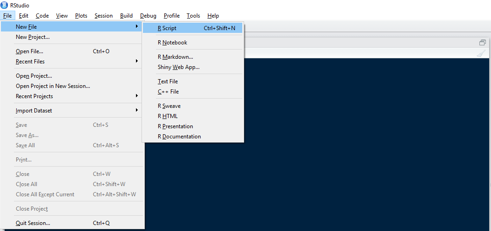

The Console is very important and useful for small tasks but if you are working on your assignment or any other project of yours you have to save your work. This is very important - first of all because **you will have to submit this file with your assignment** second, when you make a mistake you will want to review your script and avoid re-write everything! 

Script files in R are similar to  text files. In RStudio the so-called Script files are plain text, like a notepad that contains R code. You may edit a Script as you are editing a Word or a text file.

The below image shows you how to open an 'R Script' file:

Once you created a new Script give it a "good name", and save it. For example, you may call it seminar_1.

How to run your code. There are different ways of doing so. If you want to:

{}
* Run one line at a time? then place the cursor on the line you want and hit **CTRL+ENTER** on Windows and **COMMAND+ENTER** on Mac. Also, you can hit the Run button at the top right side of the Console pane. 
* Many lines at the same time?  then select the lines and hit CTRL+ENTER or use the Run button.
* The entire Script? then use the Source button 
{}
